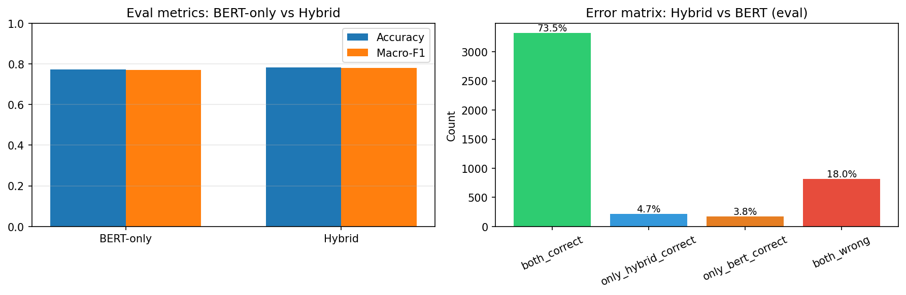
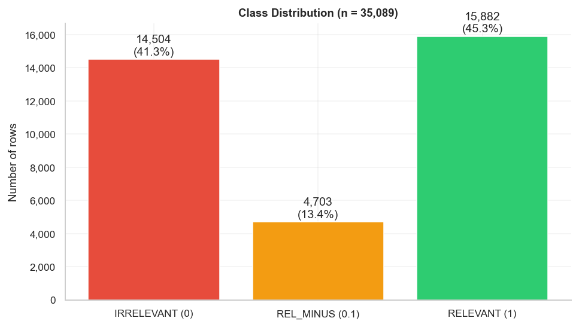
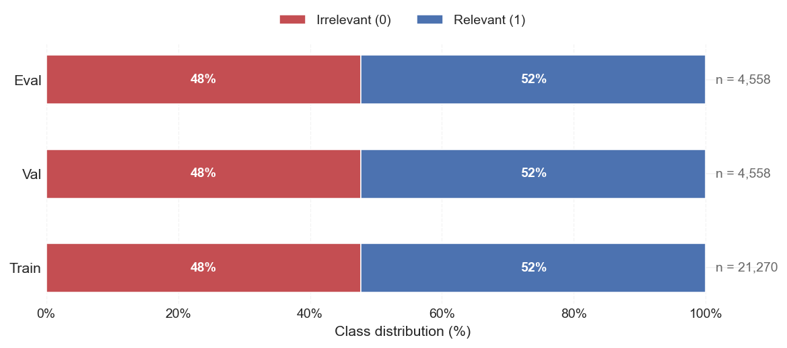

# Yandex Maps — Binary Relevance Classification (ModernBERT + LLM Hybrid)

Binary classification of organization relevance to broad user queries on Yandex Maps.  
Hybrid system: **RuModernBERT-base** cross-encoder handles confident predictions; an LLM agent (LangGraph + VseGPT) handles low-confidence ones.


## Results

| Split | System | Accuracy | Macro-F1 | Note |
|---|---|---|---|---|
| Val (n = 4,558) | BERT-only | 0.769 | 0.768 | Threshold tuned here |
| Val (n = 4,558) | **Hybrid** | **0.774** | **0.773** | |
| Eval (n = 4,558) | BERT-only | 0.771 | 0.771 | +0.2 pp vs val |
| Eval (n = 4,558) | **Hybrid** | **0.782** | **0.781** | **+0.8 pp vs val** |

The LLM agent processed 21.3% of examples (threshold = 0.68) and improved accuracy on the low-confidence subset from 0.573 to 0.618.

## Table of Contents

1. [Problem Statement](#1-problem-statement)
2. [System Architecture](#2-system-architecture)
3. [Detailed Results](#3-detailed-results)
4. [Data](#4-data)
5. [Installation](#5-installation)
6. [Quick Start](#6-quick-start)
7. [Pipeline Stages](#7-pipeline-stages)
8. [Configuration](#8-configuration)
9. [Project Structure](#9-project-structure)
10. [Known Limitations](#10-known-limitations)
11. [Reproducibility](#11-reproducibility)
12. [Terminology](#12-terminology)
13. [Author](#13-author)

---

## 1. Problem Statement

**Task:** given a pair (search query, organization card), predict a binary relevance label — 1 (relevant) or 0 (not relevant).

**Data:** 35,089 rows after removing 5 noisy duplicates by `query + permalink`. Original `relevance` classes: 0 — 41%, 0.1 — 13%, 1 — 46%.  
Source [data](https://disk.yandex.ru/d/6d5hFHvpAZjQdw) provided by Yandex for educational/research purposes; labels are the result of human assessor annotation.

**Why binary and why class 0.1 is excluded.** A/B experiments on TF-IDF (`notebooks/eda.ipynb`) showed that class 0.1 is not separable by a linear model: F1 ≈ random, uniform confusion with both neighboring classes. Experiment C confirmed that fully excluding 0.1 yields the best binary val accuracy (~0.639 vs ~0.633 for strategies that remap 0.1 → 0 or 0.1 → 1). All subsequent stages use labels `{0, 1}`.

**Splits:** 70% / 15% / 15%, stratified by label, row-level:

| Split | Rows | Note |
|---|---|---|
| train | 21,270 | |
| val | 4,558 | Used for training, calibration, threshold selection |
| eval | 4,558 | **LOCKED** — not opened until Stage 5 |
| OOD (`rel_minus`) | 4,703 | Sanity check for probability distribution |

**Metrics:** Accuracy (primary), macro-F1 (secondary, due to slight class imbalance toward 1) — fixed across all stages.

---

## 2. System Architecture

The hybrid system has two components:

- **BERT (cross-encoder)** — [`deepvk/RuModernBERT-base`](https://huggingface.co/deepvk/RuModernBERT-base), fine-tuned as a binary classifier on pairs `[query, org_text]` ([Nogueira & Cho, 2019](https://arxiv.org/abs/1901.04085)). Processes all examples and outputs calibrated probabilities ([Guo et al., 2017](https://arxiv.org/abs/1706.04599)).
- **LLM agent** (`agent/`, LangGraph + VseGPT) — invoked only for low-confidence examples, optionally uses Tavily web search ([Ding et al., 2024](https://arxiv.org/abs/2404.14618)).

```
Input pair (query, org_text)
            │
            ▼
     [BERT cross-encoder]
     bert_max_proba = max(p, 1-p)
            │
     ┌──────┴──────────────┐
  ≥ threshold           < threshold
  (high confidence)     (low confidence)
     │                       │
     ▼                       ▼
  final_pred = bert_pred  [LLM agent]
  routed_to  = bert          │
                        [decide_search]
                         LLM decides:
                         search needed?
                        ┌──────┴──────┐
                       Yes            No
                        │              │
                        ▼              │
                   [Tavily search]     │
                        └──────┬───────┘
                               ▼
                          [classify] → 0 / 1
                          routed_to = llm
```

`CONFIDENCE_THRESHOLD` is selected in Stage 3 and fixed in `reports/stage3_error_analysis/comparison.json`. The decision to use Tavily is based on manual error taxonomy of BERT mistakes: if `searchable_share` > 30% — use LLM + Tavily, otherwise — LLM only.

> **Note:** `agent/` contains only the LLM agent code (LangGraph graph, nodes, prompts). Orchestration of the full hybrid system (BERT routing + agent invocation + final parquet assembly) is implemented in `utils/stage4_agent.py` and `utils/stage5_agent.py`. Files prefixed `agent_*` in `predictions/` are LLM agent outputs; `hybrid_*` files are the full hybrid system output over the entire split.

**Training configuration (actual run, Google Colab T4) for RuModernBERT baseline:**

| Parameter | Value |
|---|---|
| Environment | Google Colab, Tesla T4 GPU |
| Epochs requested | 5 |
| Epochs completed | **2** (early stopping, patience = 1) |
| Train batch size | **8** |
| Eval batch size | **16** |
| Learning rate | 2e-5 |
| Weight decay | 0.01 |
| Warmup ratio | 0.1 |
| Mixed precision | fp16 |
| Best model criterion | val accuracy |

**Training log:**

| Epoch | Train Loss | Val Loss | Accuracy | Macro-F1 |
|---|---|---|---|---|
| 1 | 0.5567 | 0.5050 | 0.7690 | 0.7683 |
| 2 | 0.4469 | 0.5488 | 0.7685 | 0.7681 |

Early stopping triggered after epoch 2 (val loss increased, accuracy did not improve).

**Temperature scaling results:**

| Metric | Before | After |
|---|---|---|
| T | — | **1.1091** |
| NLL | 0.5050 | 0.4967 |
| ECE | 0.0564 | **0.0389** |
---

## 3. Detailed Results

Final metrics: `reports/final_eval/final_metrics.json` and `reports/final_eval/error_matrix.json`.

### Eval metrics (n = 4,558)

| Model | Accuracy | Macro-F1 | Note |
|---|---|---|---|
| TF-IDF + LR (Stage 1) | ~0.63–0.65 | ~0.62–0.64 | Lower bound, CPU |
| **BERT-only** (Stage 2) | **0.771** | **0.771** | RuModernBERT-base, threshold = 0.68 |
| **Hybrid BERT + LLM** (Stage 5) | **0.782** | **0.781** | +1.1 pp accuracy vs BERT-only |

> TF-IDF does not participate in the hybrid pipeline and serves as a lower bound only.

### Routing and LLM agent on eval

| Metric | Value |
|---|---|
| Confidence threshold | 0.68 |
| Low-confidence share | 21.3% (971 / 4,558) |
| Agent accuracy on low-conf | **0.618** |
| BERT accuracy on same low-conf (baseline) | 0.573 |
| Gain on low-conf | **+4.5 pp** |
| Share of examples with Tavily search | 13.5% of low-conf |
| LLM parse errors | 0.7% |
| Total agent runtime | ~159 min |

### Error matrix: Hybrid vs BERT-only (n = 4,527)

| Category | Examples | Share |
|---|---|---|
| Both correct | 3,326 | 73.5% |
| Hybrid correct only | **214** | **4.7%** |
| BERT correct only | 171 | 3.8% |
| Both wrong | 816 | 18.0% |

The hybrid fixes 43 more examples than it breaks (214 − 171). The remaining potential lies in the "both wrong" category (18%), which requires improving the base model or expanding context.



---

## 4. Data

### Source data

Raw data in JSONL format is in `data/raw/` (`DATA_PATH` in `utils/config.py`). EDA is in `notebooks/eda.ipynb`; processed artifacts are in `data/processed/`.



### Parquet schema (`KEEP_COLS`)

| Column | Description |
|---|---|
| `COL_ID` | Unique organization identifier in Yandex Maps |
| `COL_QUERY` | User search query |
| `COL_NAME` | Organization name |
| `COL_ADDRESS` | Address |
| `COL_RUBRIC` | Category/rubric |
| `TARGET` | Binary label {0, 1} |
| `COL_RELEVANCE` | Original label {0, 0.1, 1} (reference only) |
| `COL_REVIEWS` | Reviews (placeholder `No reviews.` if absent) |
| `COL_PRICELIST` | Price list (placeholder `No pricelist.` if absent, ~41% of rows) |

Missing values in `COL_REVIEWS` (~4%) and `COL_PRICELIST` (~41%) are not dropped: the association between missingness and class label is statistically weak (Cramér's V < 0.1). LLM agent routing is also not based on field presence — accuracy when "both fields are empty" is no worse than with full context (Δ ≈ −0.02 per EDA).

### Splits class distribution of processed data:


### Text construction at runtime (`utils/data_loader.py`)

`COL_COMBINED_TEXT` and `COL_ORG_TEXT` are **not stored** in parquet — they are built on load:

```python
from utils.data_loader import attach_combined_text, attach_org_text

# Stage 1 (TF-IDF): "Query: … Address: … Name: … Rubric: … Reviews: … Pricelist: …"
df = attach_combined_text(pd.read_parquet("data/processed/train_baseline.parquet"))

# Stages 2, 4, 5 (cross-encoder, sequence B): "Name | Address | Rubric | Reviews | Pricelist"
df = attach_org_text(pd.read_parquet("data/processed/val_baseline.parquet"))
```

The price list is included in `org_text` and in the LLM context — it matters for queries that mention a specific service or product. Cross-encoder tokenization: `[CLS] query [SEP] org_text [SEP]`, `truncation='only_second'` — the query is never truncated.

### Data example

**query**
```
генетик центр планирования семьи и репродукции
```
**org_text**
```
Эко на Петровке | Москва, 1-й Колобовский переулок, 4 | Медцентр, клиника |
Организация занимается лечением бесплодия, проводит процедуры ЭКО и предоставляет
услуги в области семейной психологии и планирования семьи. Отзывы исключительно
положительные: хвалят оборудование, опыт специалистов и индивидуальный подход. | ...
```
**label**: `1`

### Dataset statistics

| | Train | Val | Eval |
|---|---:|---:|---:|
| Documents | 21,270 | 4,558 | 4,558 |
| Irrelevant (0) | 10,152 | 2,176 | 2,176 |
| Relevant (1) | 11,118 | 2,382 | 2,382 |
| Vocabulary Size | 192,706 | 80,829 | 80,718 |
| Total Tokens | 6,003,232 | 1,282,737 | 1,281,283 |

---

## 5. Installation

**Requirements:** Python 3.10+, conda (recommended), GPU for Stage 2 and Stage 5A (Google Colab or local).

```bash
git clone <repo-url>
cd <repo>
conda env create -f environment.yml
conda activate <env-name>
```

Or via pip (key dependencies):

```bash
pip install transformers torch openai tavily-python python-dotenv \
            "langgraph==0.4.8" langchain-core pandas pyarrow scikit-learn
```

Create a `.env` file in the project root (copy from `.env.example`):

```bash
VSEGPT_API_KEY=...            # or OPENAI_API_KEY (fallback in agent/llm.py)
TAVILY_API_KEY=tvly-...       # required only if agent_architecture = with_tavily
AGENT_LLM_MODEL=deepseek/deepseek-v4-flash-alt
AGENT_USE_CACHE=true
```

> **GPU / Colab.** Stage 2 (fine-tuning) and Stage 5A (BERT inference on eval) are recommended on GPU. Notebooks `notebooks/stage2_bert_finetune.ipynb` and `notebooks/stage5a_bert_inference.ipynb` are adapted for Colab. After running, always download artifacts (`models/bert/best_checkpoint/`, `predictions/bert_eval_preds.parquet`).

For a non-standard project location, create `utils/config_local.py` with `PROJECT_ROOT`.

---

## 6. Quick Start

Stages can be run via scripts or directly in `notebooks/stage*.ipynb` — logic and artifacts are identical.

```bash
# Stage 1 — TF-IDF reference (~20 min, CPU)
python scripts/run_stage1.py

# Stage 2 — fine-tune BERT + calibration (GPU/Colab)
python scripts/run_stage2.py --epochs 3 --batch-size 16 --lr 2e-5

# Stage 3 — error analysis, threshold selection (~2–3 h including manual labeling)
python scripts/run_stage3.py --threshold 0.75

# Stage 4 — hybrid system on val
python scripts/run_stage4.py

# Stage 5 — final evaluation on eval (LOCKED until this point)
python scripts/run_stage5.py --bert-only   # 5A: BERT inference (GPU)
python scripts/run_stage5.py --agent-only  # 5B: hybrid on eval
```

> **Do not open or use `eval_baseline.parquet` before Stage 5.** All decisions (threshold, temperature) are fixed on val.

---

## 7. Pipeline Stages

### Stage 0 — EDA

**Notebook:** [`notebooks/eda.ipynb`](https://nbviewer.org/github/ChernayaAnastasia/rubert-llm-router/blob/main/notebooks/eda.ipynb) 
**Artifacts:** `data/processed/*.parquet`, `reports/eda_reports/`, `reports/eda_reports/table3_eda_summary.csv`

Exploratory data analysis, duplicate removal, justification of the binary formulation, split construction, and fixing of metrics and key project decisions.

---

### Stage 1 — TF-IDF Baseline

**Module:** `utils/stage1_baseline.py` | **Notebook:** [`notebooks/stage1_baseline.ipynb`](https://nbviewer.org/github/ChernayaAnastasia/rubert-llm-router/blob/main/notebooks/stage1_baseline.ipynb)  
**Runtime:** ~20 min (CPU)

```bash
python scripts/run_stage1.py
```

TF-IDF (50k features, ngram 1–2, sublinear TF) + LogisticRegression on `combined_text`. Serves as a lower bound; not part of the hybrid pipeline. Model and predictions are not written to disk.

**Output:** `reports/stage1_baseline/metrics.json` — val accuracy ~0.63–0.65, macro-F1 ~0.62–0.64.

---

### Stage 2 — Fine-tune RuModernBERT + Temperature Scaling

**Module:** `utils/stage2_bert.py` | **Notebook:** `notebooks/stage2_bert_finetune.ipynb` (Colab/GPU)

```bash
python scripts/run_stage2.py [--epochs 3] [--batch-size 16] [--lr 2e-5]
                             [--no-fp16] [--skip-train] [--skip-calibration]
                             [--early-stopping-patience 1] [--no-early-stopping]
                             [--resume-checkpoint PATH] [--no-auto-resume]
```

Pipeline:

1. Load train / val / OOD, build `org_text`
2. Validate labels `{0,1}`, train > 20k rows, log token length stats (p50/p90/p95)
3. Fine-tune: 3 epochs, batch 16, lr 2e-5, `eval_strategy='epoch'`, best checkpoint by accuracy
4. Temperature scaling on val logits → `models/bert/calibration.json`, reliability diagrams
5. Save `bert_val_preds.parquet`, `bert_ood_preds.parquet`

Key artifacts:

| File | Contents |
|---|---|
| `models/bert/best_checkpoint/` | Model weights |
| `models/bert/calibration.json` | Temperature T, NLL and ECE before/after scaling |
| `predictions/bert_val_preds.parquet` | `bert_pred`, `bert_proba1` (calibrated), `bert_correct` |
| `predictions/bert_ood_preds.parquet` | Same for OOD split |
| `reports/stage2_bert/metrics.json` | Val accuracy ~0.74–0.80, macro-F1 ~0.73–0.79 |
| `reports/stage2_bert/reliability_*.png` | Reliability diagrams before/after calibration |

> All `bert_proba1` values in parquet are calibrated (unless `--skip-calibration` is passed). Temperature is selected once and applied to val, OOD, and eval.

---

### Stage 3 — Error Analysis and Routing Threshold

**Module:** `utils/stage3_error_analysis.py` | **Notebook:** [`notebooks/stage3_error_analysis.ipynb`](https://github.com/ChernayaAnastasia/rubert-llm-router/blob/main/notebooks/stage3_error_analysis.ipynb)  
**Runtime:** ~2–3 h (including manual labeling)

```bash
python scripts/run_stage3.py [--threshold 0.75]
```

This stage answers two questions: (1) at what `bert_max_proba` threshold to route an example to the LLM agent; (2) whether Tavily is needed or LLM alone is sufficient.

**Threshold selection.** The first threshold with coverage ≥ 70% and accuracy on confident examples ≥ overall + 5 pp. If none is found, `CONFIDENCE_THRESHOLD_DEFAULT = 0.75` is used. Routing always uses `bert_max_proba = max(bert_proba1, 1 − bert_proba1)`, not raw `bert_proba1`.

**Manual error taxonomy.** ~96 rows are sampled from BERT errors on val (`bert_errors_sample.csv`): priority given to high-confidence errors (`bert_max_proba ≥ 0.75`), stratified by TARGET class. Sample size by Cochran's formula: p ≈ 0.30, 95% confidence, ±10 pp margin ([Cochran, 1977](https://www.wiley.com/en-us/Sampling+Techniques%2C+3rd+Edition-p-9780471162407)). Annotation categories: `requires_search`, `hard_semantic`, `fact_verification`, `label_noise`, `other`. If `searchable_share` > 30% → `agent_architecture = with_tavily`, otherwise `= llm_only`.

Artifacts:

| File | Contents |
|---|---|
| `predictions/val_merged_preds.parquet` | Val + `bert_pred`, `bert_proba1`, `bert_correct`, `bert_max_proba` → input for Stage 4 |
| `reports/stage3_error_analysis/comparison.json` | Threshold, T, taxonomy, `searchable_share`, `agent_architecture`, model comparison |
| `reports/stage3_error_analysis/fig_accuracy_coverage.png` | Accuracy vs coverage, coverage vs threshold |
| `reports/stage3_error_analysis/bert_errors_sample.csv` | ~96 rows for manual annotation |

---

### Stage 4 — Hybrid System on Val

**Modules:** `utils/stage4_agent.py` (orchestration) + `agent/` (LLM agent) | **Notebook:** [`notebooks/stage4_agent.ipynb`](https://github.com/ChernayaAnastasia/rubert-llm-router/blob/main/notebooks/stage4_agent.ipynb)

```bash
python scripts/run_stage4.py [--sample 50] [--sleep 0.1] [--model MODEL_NAME]
```

Input: `predictions/val_merged_preds.parquet` (preferred) or `bert_val_preds.parquet` + `enrich_bert_predictions()`. Threshold is read from `comparison.json` via `utils/bert_routing.load_confidence_threshold()`.

LangGraph graph (`agent/graph.py`): `bert_route` → on high confidence `END` (pred = bert_pred); on low confidence → `decide_search` → optionally `[search]` Tavily → `[classify]` LLM → `END`. LLM context: query, name, address, rubric, reviews, pricelist.

Artifacts:

| File | Contents |
|---|---|
| `predictions/agent_low_conf_preds.parquet` | Low-conf only: final_pred, routed_to, search_used, tokens, latency |
| `predictions/hybrid_val_preds.parquet` | Full val: hybrid system output |
| `reports/stage4_agent/agent_metrics.json` | Accuracy / F1 hybrid vs BERT-only, search share, cost, latency |

---

### Stage 5 — Final Evaluation on Eval

> **Open `eval_baseline.parquet` only here.** Threshold and temperature are not changed — they were fixed in Stages 2 and 3.

The stage is split into two parts that can run on separate machines.

**Stage 5A — BERT inference** (`utils/stage5_bert.py` | **Notebook**: [notebooks/stage5a_bert_inference.ipynb](https://github.com/ChernayaAnastasia/rubert-llm-router/blob/main/notebooks/stage5a_bert_inference.ipynb), GPU/Colab):

```bash
python scripts/run_stage5.py --bert-only
```

Reads `eval_baseline.parquet`, builds `org_text`, applies the model with calibrated temperature → `predictions/bert_eval_preds.parquet`.

**Stage 5B — hybrid system on eval** (`utils/stage5_agent.py` | **Notebook**: [notebooks/stage5b_agent_loop.ipynb](https://github.com/ChernayaAnastasia/rubert-llm-router/blob/main/notebooks/stage5b_agent_loop.ipynb)):

```bash
python scripts/run_stage5.py --agent-only
```

Reads `bert_eval_preds.parquet`, routes low-confidence examples through the LLM agent → `predictions/agent_eval_preds.parquet`.

Full run on a single machine (debug):

```bash
python scripts/run_stage5.py [--sample N] [--sleep 0.1]
```

Final artifacts:

| File | Contents |
|---|---|
| `predictions/agent_eval_preds.parquet` | Full eval: hybrid system output |
| `reports/final_eval/final_metrics.json` | Accuracy / F1: BERT-only and hybrid on eval |
| `reports/final_eval/error_matrix.json` | BERT-only vs hybrid comparison |
| `reports/final_eval/fig_hybrid_vs_bert.png` | Comparison visualization |

---

## 8. Configuration

All constants and paths are in `utils/config.py`. Key entries:

| Constant | Value | Purpose |
|---|---|---|
| `BERT_MODEL_NAME` | `deepvk/RuModernBERT-base` | Base model |
| `BERT_MAX_LENGTH` | `1024` | Max tokens (up to 8,192 supported) |
| `CONFIDENCE_THRESHOLD_DEFAULT` | `0.75` | Fallback threshold (actual: 0.68, see `comparison.json`) |
| `AGENT_LLM_MODEL` | from `.env` | LLM agent model |
| `AGENT_USE_CACHE` | `true` | Cache LLM and Tavily responses |
| `BERT_CALIBRATION_PATH` | `models/bert/calibration.json` | Temperature T |
| `STAGE3_COMPARISON_PATH` | `reports/stage3_error_analysis/comparison.json` | Threshold and architecture |

For a non-standard project location, create `utils/config_local.py`:

```python
PROJECT_ROOT = "/path/to/your/project"
```

---

## 9. Project Structure

```
project_root/
├── data/
│   ├── raw/                          # Raw data (JSONL)
│   └── processed/
│       ├── train_baseline.parquet
│       ├── val_baseline.parquet
│       ├── eval_baseline.parquet     # LOCKED until Stage 5
│       └── rel_minus_baseline.parquet  # OOD (4,703 rows)
├── models/
│   └── bert/
│       ├── best_checkpoint/          # Fine-tuned model weights
│       ├── checkpoints/              # Intermediate checkpoints
│       ├── training_args.json
│       └── calibration.json          # Temperature T, ECE
├── predictions/                      # Per-stage prediction parquets
├── reports/
│   ├── eda_reports/
│   ├── stage1_baseline/
│   ├── stage2_bert/
│   ├── stage3_error_analysis/
│   ├── stage4_agent/
│   └── final_eval/
├── notebooks/                        # Primary way to run stages
│   ├── eda.ipynb
│   ├── stage1_baseline.ipynb
│   ├── stage2_bert_finetune.ipynb    # Colab/GPU
│   ├── stage3_error_analysis.ipynb
│   ├── stage4_agent.ipynb
│   ├── stage5a_bert_inference.ipynb  # Colab/GPU
│   └── stage5b_agent_loop.ipynb
├── utils/
│   ├── config.py                     # All constants and paths
│   ├── data_loader.py                # build_combined_text, make_org_text
│   ├── calibration.py                # fit_temperature, apply_temperature, ECE
│   ├── metrics.py                    # eval_core, eval_binary, error_matrix
│   ├── predict.py                    # predict_bert() — single inference entry point
│   ├── bert_routing.py               # load_confidence_threshold, max_confidence_series
│   ├── agent_import.py               # Agent environment check
│   ├── langchain_compat.py
│   └── stage1_baseline.py … stage5_eval.py
├── scripts/
│   └── run_stage1.py … run_stage5.py
├── agent/                            # LLM agent only (LangGraph)
│   ├── graph.py                      # LangGraph graph
│   ├── nodes.py                      # Nodes: bert_route, decide_search, search, classify
│   ├── state.py
│   ├── llm.py                        # VseGPT / OpenAI client
│   ├── search.py                     # Tavily wrapper
│   ├── prompts.py                    # format_org_context
│   └── search_cache/
├── environment.yml
├── requirements.txt
├── known_project_limits.txt
└── .env
```

Key `utils/` modules:

- `data_loader.py` — single source of truth for building `combined_text` and `org_text`; identical logic across all stages.
- `predict.py` — single BERT inference entry point for Stage 5A and external scripts: `predict_bert(queries, org_texts)` → `{pred, proba1}` with temperature scaling.
- `bert_routing.py` — `load_confidence_threshold()` reads threshold from `comparison.json`; `max_confidence_series()` — vectorized `max(p, 1−p)`.
- `calibration.py` — `fit_temperature` (LBFGS), `apply_temperature`, ECE, reliability plots.
- `metrics.py` — `eval_core` (accuracy + macro-F1), `eval_binary` (+ classification_report + JSON), `error_matrix` (BERT-only vs hybrid).

---

## 10. Known Limitations

See [`known_project_limits.txt`](known_project_limits.txt) for full details.

**LIMIT-01 — Temperature scaling fitted on val.**  
No separate calibration split: val is used for both model training and temperature selection. This introduces a small optimistic bias in T on eval. Implementation: `utils/calibration.py` → `fit_temperature` (LBFGS), result saved to `BERT_CALIBRATION_PATH`.

**LIMIT-02 — `CONFIDENCE_THRESHOLD` selected on val.**  
No separate held-out set for threshold tuning, which could introduce a slight optimistic bias. In practice, eval metrics matched or slightly exceeded val
(accuracy 0.782 vs 0.774 for the hybrid), suggesting the threshold generalized well to unseen data. Stage 5 shows the real picture. Loading: `utils/bert_routing.load_confidence_threshold()` → `comparison.json`.

**LIMIT-03 — Temperature scaling only.**  
Platt scaling and isotonic regression were not used: both risk overfitting on val, which is already used for model training. (In practice, no signs of overfitting on val.) ECE after scaling is saved in `calibration.json`.

**LIMIT-04 — `BERT_MAX_LENGTH = 1024`.**  
Training: `padding='max_length'`; inference: dynamic padding up to value from `training_args.json`. RuModernBERT supports up to 8,192 tokens. On OOM: reduce `batch_size` and/or add `gradient_accumulation_steps`.

**LIMIT-05 — LLM agent is non-deterministic.**  
Results may vary slightly between runs. Tavily cache (`SEARCH_CACHE_DIR`) and `AGENT_USE_CACHE=true` reduce variability on repeated runs.

---

## 11. Reproducibility

- **BERT:** fix `seed` in `training_args` (Stage 2). Best checkpoint saved to `models/bert/best_checkpoint/`.
- **Calibration and threshold:** selected once on val, fixed in `calibration.json` and `comparison.json`. Not recomputed in Stages 4–5.
- **LLM agent:** enable `AGENT_USE_CACHE=true` — repeated Tavily and LLM requests return cached responses from `agent/search_cache/`.
- **Splits:** train/val/eval are created in `notebooks/eda.ipynb` and never modified afterwards.

---

## 12. Terminology

| Term | Definition |
|---|---|
| **Hybrid system** | Full pipeline: confident examples → BERT, low-confidence → LLM agent (optionally Tavily). Metrics labeled "hybrid" in reports refer to this full system. |
| **LLM agent** | Component in `agent/` (LangGraph + VseGPT). Processes only low-confidence examples after routing. |
| `bert_max_proba` | `max(bert_proba1, 1 − bert_proba1)` — model confidence used for routing. |
| `agent_*` file names | Historically: LLM agent output or its loop (including `agent_eval_preds.parquet` = full eval hybrid output). |
| `hybrid_*` file names | Full hybrid system output over the entire val split. |
| `org_text` | Organization description without the query: `Name | Address | Rubric | Reviews | Pricelist`. Sequence B in the cross-encoder. |
| `combined_text` | Full text for TF-IDF: `Query: … Address: … Name: … Rubric: … Reviews: … Pricelist: …`. |
| eval LOCKED | `eval_baseline.parquet` is not used until Stage 5 — for an honest final evaluation. |


## 13. Author

**Chernaya Anastasia** - [Telegram](https://t.me/ChernayaAnastasia), [GitHub](https://github.com/ChernayaAnastasia)
